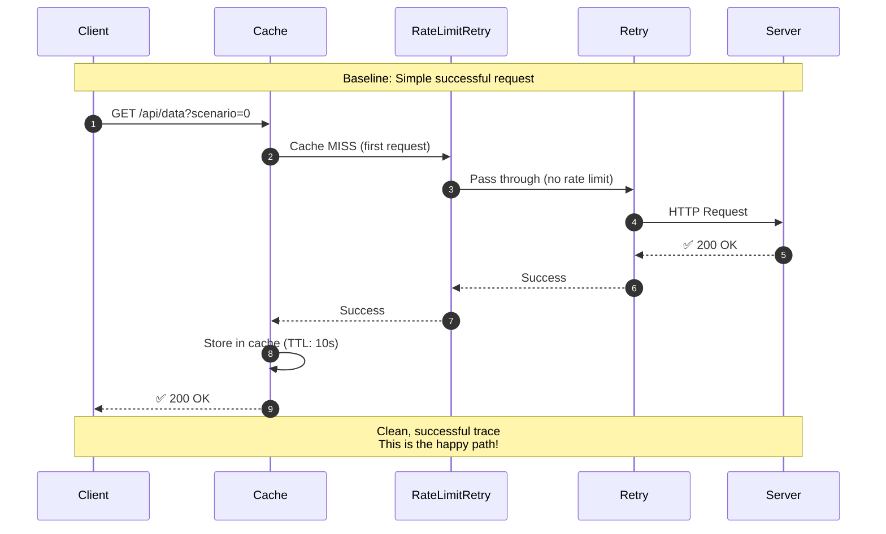

# Scenario 0: Baseline - Successful Request

## Key Points

- **Green trace**: Everything works perfectly
- **All middleware layers**: Even on success, request flows through all layers
- **Cache populated**: Response cached for future requests
- **Baseline reference**: Compare other scenarios to this

## What You'll See in Jaeger

- Single successful HTTP request
- All middleware layers visible as spans
- No errors, no retries
- Fast response time (~100-200ms)
