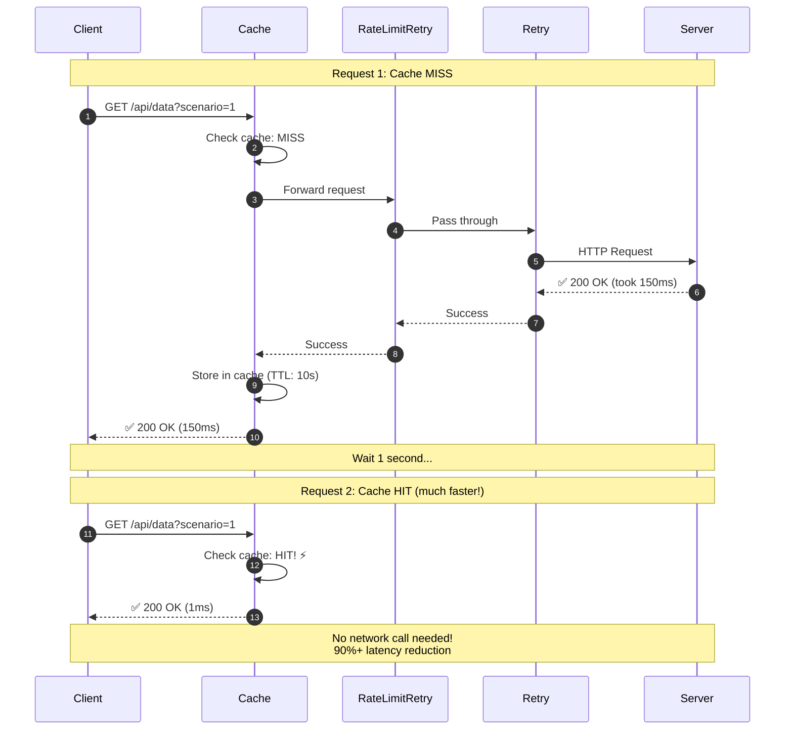

# Scenario 1: Cache Demonstration



## Key Points

- **Cache MISS**: First request goes to server (slower)
- **Cache HIT**: Second request served from cache (much faster)
- **TTL**: Cache expires after 10 seconds
- **Massive speedup**: 150ms → 1ms (150x faster!)

## Configuration

```go
middleware.Cache(middleware.CacheConfig{
    TTL:    10 * time.Second,
    Tracer: otelTracer,
})
```

## What You'll See in Jaeger

### Request 1 (Cache MISS):
- Full middleware chain executed
- Network request to server
- Cache span shows `cache.hit=false`

### Request 2 (Cache HIT):
- Only Cache span visible
- No RateLimitRetry/Retry/Server spans
- Cache span shows `cache.hit=true`
- Dramatically shorter trace
