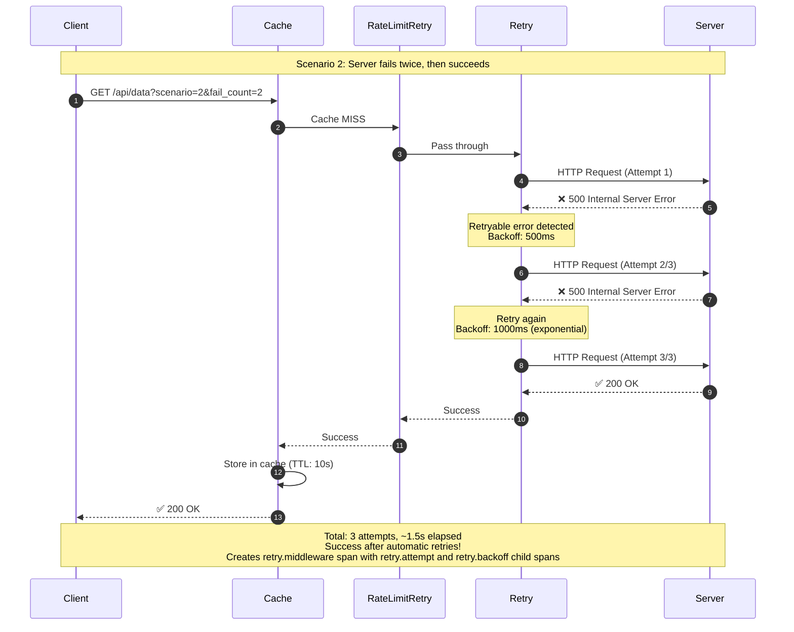

# Scenario 2: Retry with Exponential Backoff



## Key Points

- **Automatic Retry**: Middleware transparently retries failed requests
- **Exponential Backoff**: 500ms → 1s → 2s → 4s → ...
- **MaxRetries**: Configured for 3 attempts
- **Transparent**: Application code doesn't need to handle retries
- **Observable**: Each attempt creates a span in Jaeger trace

## Configuration

```go
middleware.Retry(middleware.RetryConfig{
    MaxRetries: 3,
    Backoff: middleware.NewExponentialBackoff(
        500*time.Millisecond,  // Initial interval
        5*time.Second,         // Max interval
        30*time.Second,        // Max elapsed time
    ),
    Tracer: otelTracer,
})
```

## What You'll See in Jaeger

- Root span: `retry.middleware`
- Child spans: `retry.attempt` (one for each attempt - 3 total)
- Child spans: `retry.backoff` (one for each wait period - 2 total: 500ms, 1000ms)
- Attributes show attempt numbers and backoff durations
- Timing shows exponential backoff delays
- Final status: Success (green)
