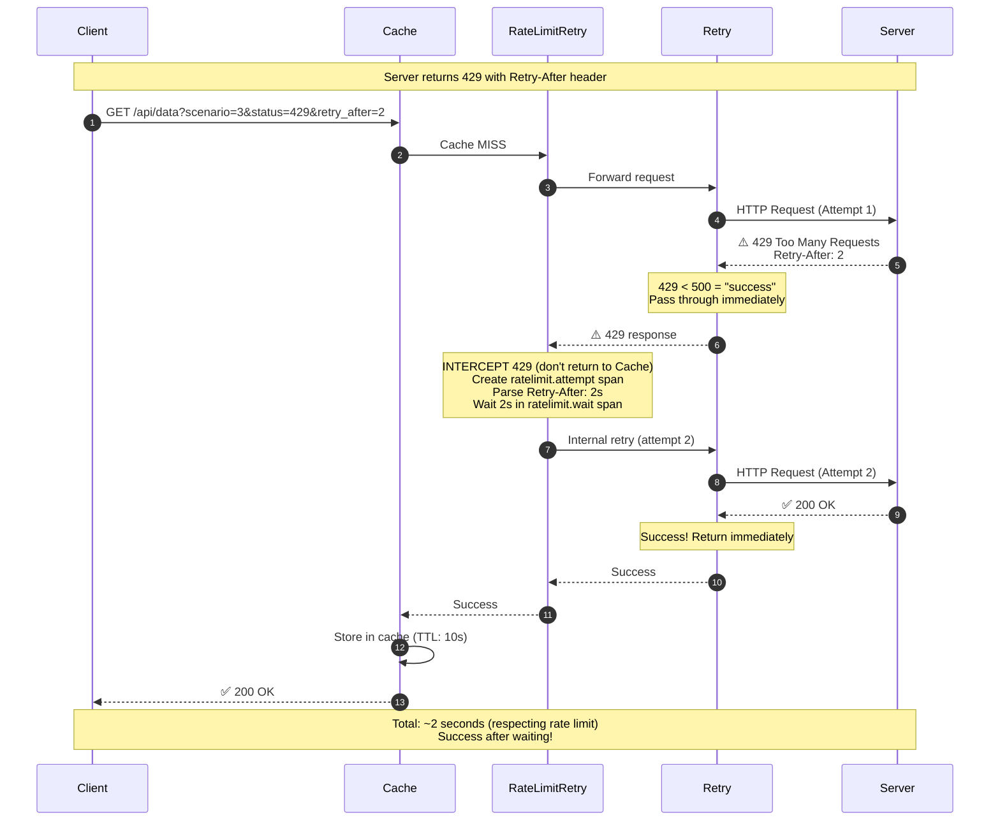

# Scenario 3: Rate Limit Retry Demonstration



## Key Points

- **429 Handling**: RateLimitRetry intercepts 429 responses and retries internally
- **Retry Middleware**: Treats 429 as "success" (status < 500), passes it through without retrying
- **RateLimitRetry Role**: Specialized middleware that handles rate limits with Retry-After header
- **Retry-After Header**: Respects server's backoff instruction (2 seconds in this example)
- **MaxRetries**: Will retry up to 2 times (configurable)
- **Separation of Concerns**: Retry handles 5xx, RateLimitRetry handles 429

## Configuration

```go
middleware.RateLimitRetry(middleware.RateLimitRetryConfig{
    MaxRetries:        2,
    MaxRetryAfterWait: 10 * time.Second,
    DefaultRetryAfter: 2 * time.Second,
    Tracer:            otelTracer,
})
```

## What You'll See in Jaeger

- Root span: `ratelimit.middleware` (created at entry)
  - `ratelimit.total_429s=1`
  - `ratelimit.triggered=true`
- Child span: `ratelimit.attempt` (created when 429 detected)
  - `http.status_code=429`
  - `ratelimit.attempt=0`
  - `ratelimit.retry_after_ms=2000`
  - `retry_after_header="2"`
- Grandchild span: `ratelimit.wait` showing 2s wait period
  - `wait_duration_ms=2000`
  - `retry_attempt=1`
- Events: "Received 429 Too Many Requests", "Parsing Retry-After header", "Waiting 2s before retry"
- Total span duration: ~2 seconds
