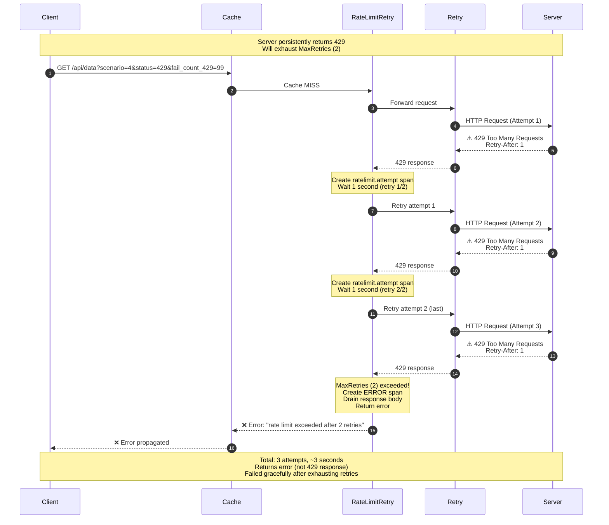

# Scenario 4: Rate Limit Retry Exhaustion



## Key Points

- **MaxRetries Limit**: Protects against infinite retry loops
- **Fail Gracefully**: Returns error after exhausting attempts
- **Error Return**: Returns `error` with message "rate limit exceeded after N retries"
- **Response Handling**: Response body is drained and closed before returning error
- **Observable**: All attempts visible in Jaeger (marked as ERROR)
- **Total Attempts**: Initial + MaxRetries = 1 + 2 = 3 attempts

## Configuration

```go
middleware.RateLimitRetry(middleware.RateLimitRetryConfig{
    MaxRetries:        2,  // Retry up to 2 times
    MaxRetryAfterWait: 10 * time.Second,
    DefaultRetryAfter: 2 * time.Second,
    Tracer:            otelTracer,
})
```

## What You'll See in Jaeger

- **Red trace**: Indicates failure
- Root span: `ratelimit.middleware` (covers entire operation)
  - `ratelimit.total_429s=3`
  - `ratelimit.total_attempts=3`
  - `ratelimit.succeeded=false`
  - `ratelimit.final_error="max_retries_exceeded"`
- Multiple `ratelimit.attempt` child spans (one per 429: 3 total)
  - `ratelimit.attempt` attribute (0, 1, 2)
  - `http.status_code=429`
  - `retry_after_header="1"`
  - `ratelimit.retry_after_ms=1000`
- Multiple `ratelimit.wait` grandchild spans (one per wait: 2 total)
  - `wait_duration_ms=1000`
- Final attempt span has ERROR status:
  - `ratelimit.error="max_retries_exceeded"`
  - Status: Error, "max retries exceeded"
- Span duration: ~3 seconds total (3 attempts × 1s wait)
- Error returned: "rate limit exceeded after 2 retries"
