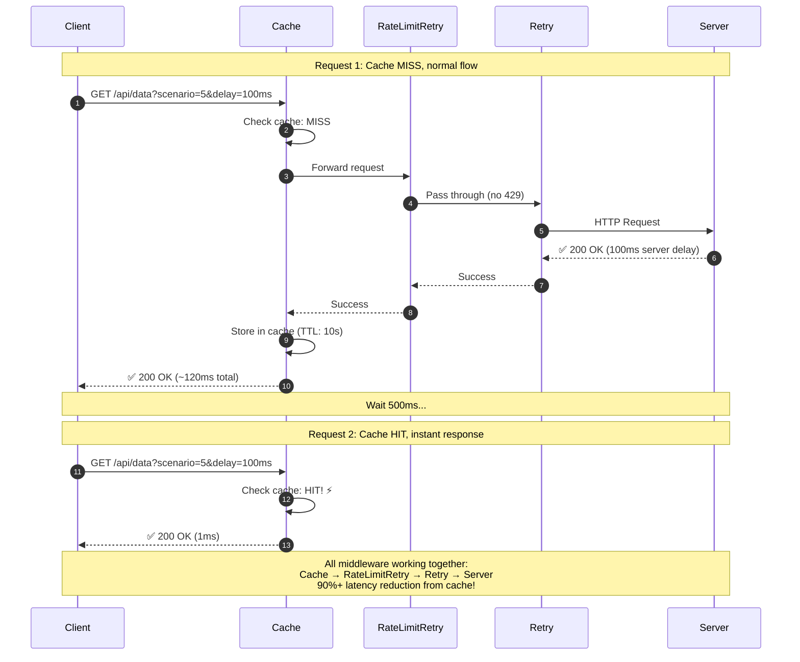

# Scenario 5: Combined Middleware Demonstration



## Key Points

- **Full Stack**: Demonstrates all middleware layers working together
- **Cache First**: Cache short-circuits on hit (no downstream calls)
- **Ready for Failures**: Rate limit and retry middleware ready if needed
- **Production Pattern**: This is the complete, production-ready setup

## Middleware Chain (Order Matters!)

```go
httpClient := middleware.WrapClient(baseClient,
    // 1. Cache (outermost) - short-circuit if possible
    middleware.Cache(middleware.CacheConfig{
        TTL: 10 * time.Second,
        Tracer: otelTracer,
    }),
    // 2. RateLimitRetry - handle 429 specifically
    middleware.RateLimitRetry(middleware.RateLimitRetryConfig{
        MaxRetries: 2,
        MaxRetryAfterWait: 10 * time.Second,
        DefaultRetryAfter: 2 * time.Second,
        Tracer: otelTracer,
    }),
    // 3. Retry (innermost) - handle transient failures
    middleware.Retry(middleware.RetryConfig{
        MaxRetries: 3,
        Backoff: middleware.NewExponentialBackoff(...),
        Tracer: otelTracer,
    }),
)
```

## Why This Order?

1. **Cache First**: Avoid unnecessary work if response is cached
2. **Rate Limit Before Retry**: Specialized handling for 429
3. **General Retry Last**: Catches all other transient failures

## What You'll See in Jaeger

### Request 1 (Cache MISS):
- Full middleware chain visible
- Spans: `cache.middleware` → (no ratelimit span for non-429) → `retry.middleware` → HTTP
- Note: RateLimitRetry passes through silently when no 429
- Total latency: ~120ms

### Request 2 (Cache HIT):
- Only `cache.middleware` span visible
- Cache attribute: `cache.hit=true`
- No downstream middleware invoked
- Total latency: ~1ms (120x faster!)
