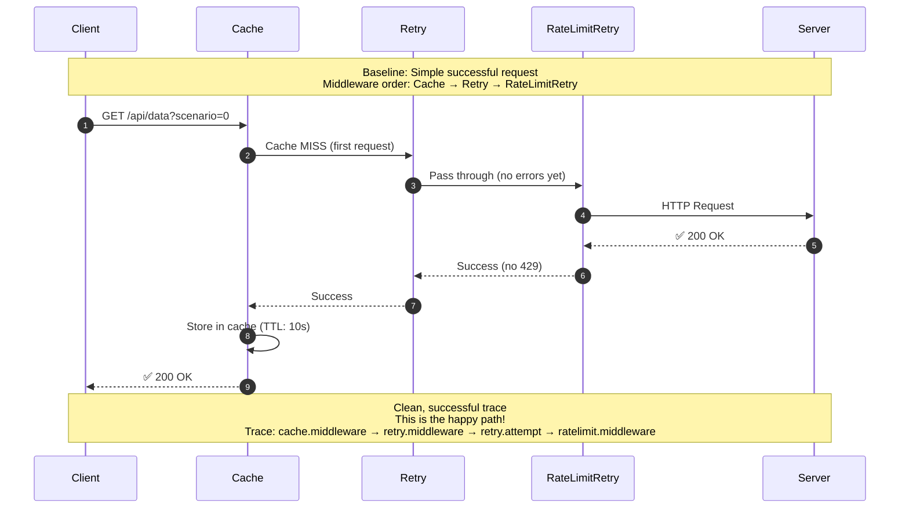

# Scenario 0: Baseline - Successful Request

```mermaid
sequenceDiagram
    autonumber
    participant Client
    participant Cache
    participant Retry
    participant RateLimitRetry
    participant Server

    Note over Client,Server: Baseline: Simple successful request<br/>Middleware order: Cache → Retry → RateLimitRetry

    Client->>Cache: GET /api/data?scenario=0
    Cache->>Retry: Cache MISS (first request)
    Retry->>RateLimitRetry: Pass through (no errors yet)
    RateLimitRetry->>Server: HTTP Request
    Server-->>RateLimitRetry: ✅ 200 OK
    RateLimitRetry-->>Retry: Success (no 429)
    Retry-->>Cache: Success
    Cache->>Cache: Store in cache (TTL: 10s)
    Cache-->>Client: ✅ 200 OK

    Note over Client,Server: Clean, successful trace<br/>This is the happy path!<br/>Trace: cache.middleware → retry.middleware → retry.attempt → ratelimit.middleware
```
