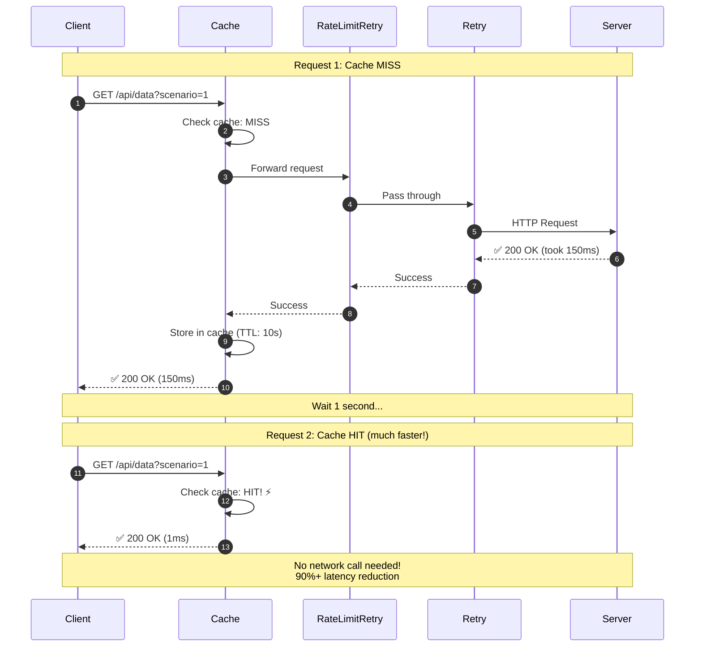

# Scenario 1: Cache Demonstration

```mermaid
sequenceDiagram
    autonumber
    participant Client
    participant Cache
    participant RateLimitRetry
    participant Retry
    participant Server

    Note over Client,Server: Request 1: Cache MISS

    Client->>Cache: GET /api/data?scenario=1
    Cache->>Cache: Check cache: MISS
    Cache->>RateLimitRetry: Forward request
    RateLimitRetry->>Retry: Pass through
    Retry->>Server: HTTP Request
    Server-->>Retry: ✅ 200 OK (took 150ms)
    Retry-->>RateLimitRetry: Success
    RateLimitRetry-->>Cache: Success
    Cache->>Cache: Store in cache (TTL: 10s)
    Cache-->>Client: ✅ 200 OK (150ms)

    Note over Client,Server: Wait 1 second...

    Note over Client,Server: Request 2: Cache HIT (much faster!)

    Client->>Cache: GET /api/data?scenario=1
    Cache->>Cache: Check cache: HIT! ⚡
    Cache-->>Client: ✅ 200 OK (1ms)

    Note over Client,Server: No network call needed!<br/>90%+ latency reduction
```
