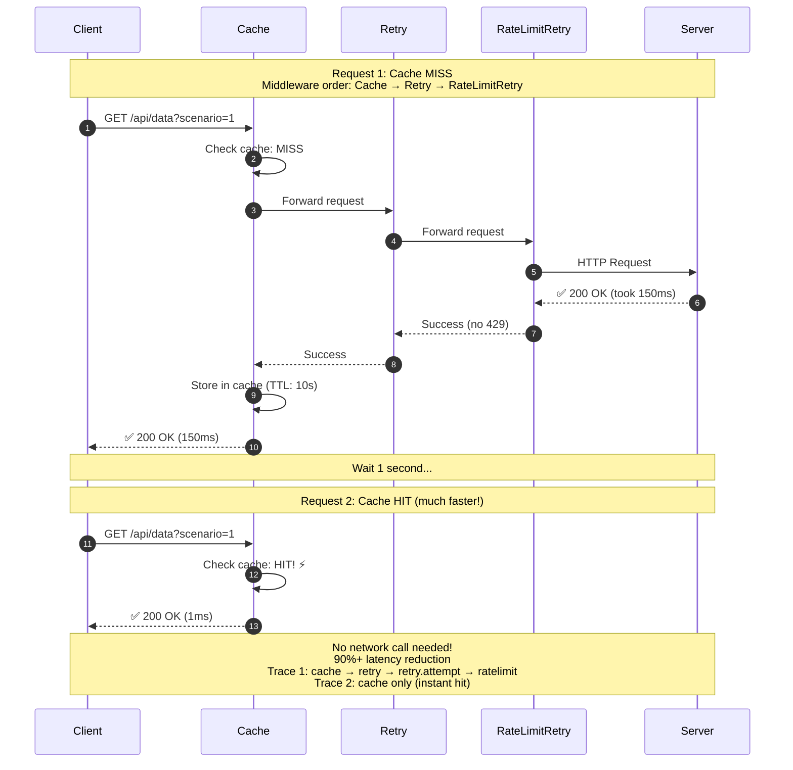

# Scenario 1: Cache Demonstration

```mermaid
sequenceDiagram
    autonumber
    participant Client
    participant Cache
    participant Retry
    participant RateLimitRetry
    participant Server

    Note over Client,Server: Request 1: Cache MISS<br/>Middleware order: Cache → Retry → RateLimitRetry

    Client->>Cache: GET /api/data?scenario=1
    Cache->>Cache: Check cache: MISS
    Cache->>Retry: Forward request
    Retry->>RateLimitRetry: Forward request
    RateLimitRetry->>Server: HTTP Request
    Server-->>RateLimitRetry: ✅ 200 OK (took 150ms)
    RateLimitRetry-->>Retry: Success (no 429)
    Retry-->>Cache: Success
    Cache->>Cache: Store in cache (TTL: 10s)
    Cache-->>Client: ✅ 200 OK (150ms)

    Note over Client,Server: Wait 1 second...

    Note over Client,Server: Request 2: Cache HIT (much faster!)

    Client->>Cache: GET /api/data?scenario=1
    Cache->>Cache: Check cache: HIT! ⚡
    Cache-->>Client: ✅ 200 OK (1ms)

    Note over Client,Server: No network call needed!<br/>90%+ latency reduction<br/>Trace 1: cache → retry → retry.attempt → ratelimit<br/>Trace 2: cache only (instant hit)
```
