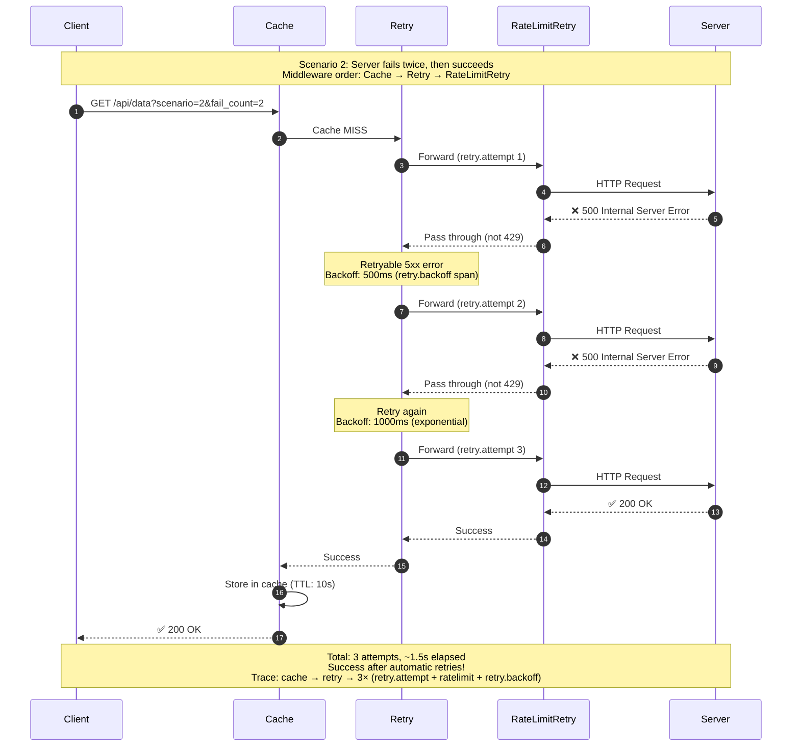

# Scenario 2: Retry with Exponential Backoff

```mermaid
sequenceDiagram
    autonumber
    participant Client
    participant Cache
    participant Retry
    participant RateLimitRetry
    participant Server

    Note over Client,Server: Scenario 2: Server fails twice, then succeeds<br/>Middleware order: Cache → Retry → RateLimitRetry

    %% Attempt 1 - First Failure
    Client->>Cache: GET /api/data?scenario=2&fail_count=2
    Cache->>Retry: Cache MISS
    Retry->>RateLimitRetry: Forward (retry.attempt 1)
    RateLimitRetry->>Server: HTTP Request
    Server-->>RateLimitRetry: ❌ 500 Internal Server Error
    RateLimitRetry-->>Retry: Pass through (not 429)
    Note over Retry: Retryable 5xx error<br/>Backoff: 500ms (retry.backoff span)

    %% Attempt 2 - Second Failure
    Retry->>RateLimitRetry: Forward (retry.attempt 2)
    RateLimitRetry->>Server: HTTP Request
    Server-->>RateLimitRetry: ❌ 500 Internal Server Error
    RateLimitRetry-->>Retry: Pass through (not 429)
    Note over Retry: Retry again<br/>Backoff: 1000ms (exponential)

    %% Attempt 3 - Success
    Retry->>RateLimitRetry: Forward (retry.attempt 3)
    RateLimitRetry->>Server: HTTP Request
    Server-->>RateLimitRetry: ✅ 200 OK
    RateLimitRetry-->>Retry: Success
    Retry-->>Cache: Success
    Cache->>Cache: Store in cache (TTL: 10s)
    Cache-->>Client: ✅ 200 OK

    Note over Client,Server: Total: 3 attempts, ~1.5s elapsed<br/>Success after automatic retries!<br/>Trace: cache → retry → 3× (retry.attempt + ratelimit + retry.backoff)
```
