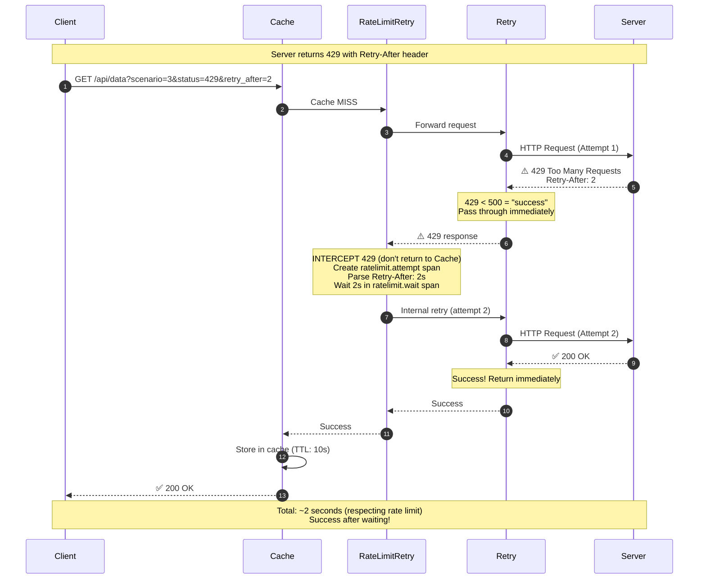

# Scenario 3: Rate Limit Retry

```mermaid
sequenceDiagram
    autonumber
    participant Client
    participant Cache
    participant RateLimitRetry
    participant Retry
    participant Server

    Note over Client,Server: Server returns 429 with Retry-After header

    Client->>Cache: GET /api/data?scenario=3&status=429&retry_after=2
    Cache->>RateLimitRetry: Cache MISS

    %% First attempt - Rate Limited
    RateLimitRetry->>Retry: Forward request
    Retry->>Server: HTTP Request (Attempt 1)
    Server-->>Retry: ⚠️ 429 Too Many Requests<br/>Retry-After: 2
    Note over Retry: 429 < 500 = "success"<br/>Pass through immediately
    Retry-->>RateLimitRetry: ⚠️ 429 response
    Note over RateLimitRetry: INTERCEPT 429 (don't return to Cache)<br/>Create ratelimit.attempt span<br/>Parse Retry-After: 2s<br/>Wait 2s in ratelimit.wait span

    %% Second attempt - Success
    RateLimitRetry->>Retry: Internal retry (attempt 2)
    Retry->>Server: HTTP Request (Attempt 2)
    Server-->>Retry: ✅ 200 OK
    Note over Retry: Success! Return immediately
    Retry-->>RateLimitRetry: Success
    RateLimitRetry-->>Cache: Success
    Cache->>Cache: Store in cache (TTL: 10s)
    Cache-->>Client: ✅ 200 OK

    Note over Client,Server: Total: ~2 seconds (respecting rate limit)<br/>Success after waiting!
```
