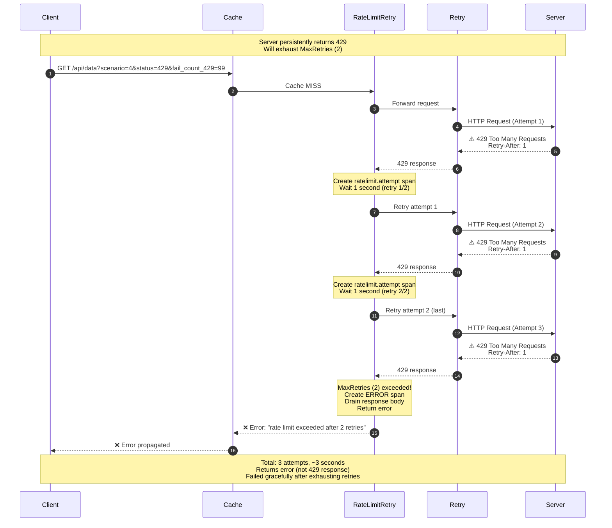

# Scenario 4: Rate Limit Retry Exhaustion

```mermaid
sequenceDiagram
    autonumber
    participant Client
    participant Cache
    participant RateLimitRetry
    participant Retry
    participant Server

    Note over Client,Server: Server persistently returns 429<br/>Will exhaust MaxRetries (2)

    Client->>Cache: GET /api/data?scenario=4&status=429&fail_count_429=99
    Cache->>RateLimitRetry: Cache MISS

    %% Attempt 1
    RateLimitRetry->>Retry: Forward request
    Retry->>Server: HTTP Request (Attempt 1)
    Server-->>Retry: ⚠️ 429 Too Many Requests<br/>Retry-After: 1
    Retry-->>RateLimitRetry: 429 response
    Note over RateLimitRetry: Create ratelimit.attempt span<br/>Wait 1 second (retry 1/2)

    %% Attempt 2
    RateLimitRetry->>Retry: Retry attempt 1
    Retry->>Server: HTTP Request (Attempt 2)
    Server-->>Retry: ⚠️ 429 Too Many Requests<br/>Retry-After: 1
    Retry-->>RateLimitRetry: 429 response
    Note over RateLimitRetry: Create ratelimit.attempt span<br/>Wait 1 second (retry 2/2)

    %% Attempt 3 - Final attempt, still fails
    RateLimitRetry->>Retry: Retry attempt 2 (last)
    Retry->>Server: HTTP Request (Attempt 3)
    Server-->>Retry: ⚠️ 429 Too Many Requests<br/>Retry-After: 1
    Retry-->>RateLimitRetry: 429 response
    Note over RateLimitRetry: MaxRetries (2) exceeded!<br/>Create ERROR span<br/>Drain response body<br/>Return error

    RateLimitRetry-->>Cache: ❌ Error: "rate limit exceeded after 2 retries"
    Cache-->>Client: ❌ Error propagated

    Note over Client,Server: Total: 3 attempts, ~3 seconds<br/>Returns error (not 429 response)<br/>Failed gracefully after exhausting retries
```
