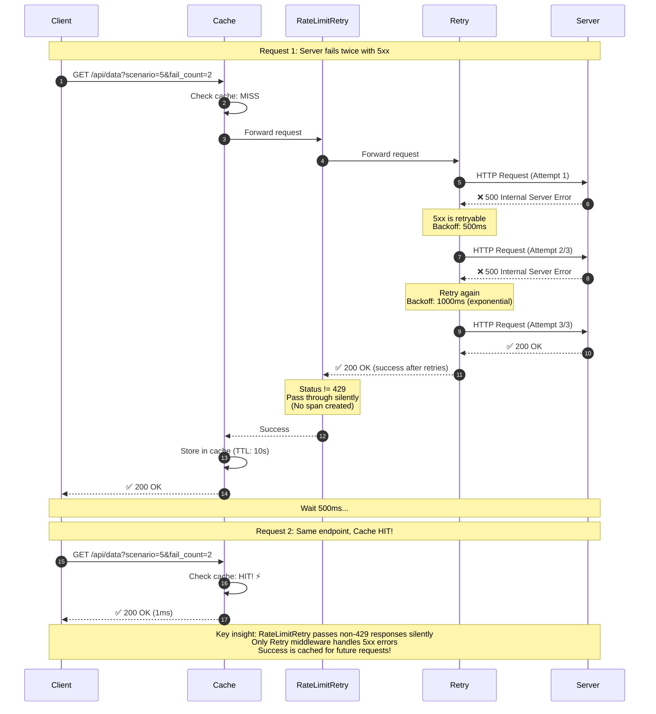

# Scenario 5: 5xx Retry

RateLimitRetry passes 5xx errors to Retry middleware (architectural separation).

```mermaid
sequenceDiagram
    autonumber
    participant Client
    participant Cache
    participant RateLimitRetry
    participant Retry
    participant Server

    Note over Client,Server: Request 1: Server fails twice with 5xx

    Client->>Cache: GET /api/data?scenario=5&fail_count=2
    Cache->>Cache: Check cache: MISS
    Cache->>RateLimitRetry: Forward request

    %% RateLimitRetry forwards to Retry
    RateLimitRetry->>Retry: Forward request

    %% First attempt - 5xx error
    Retry->>Server: HTTP Request (Attempt 1)
    Server-->>Retry: ❌ 500 Internal Server Error
    Note over Retry: 5xx is retryable<br/>Backoff: 500ms

    %% Second attempt - still 5xx
    Retry->>Server: HTTP Request (Attempt 2/3)
    Server-->>Retry: ❌ 500 Internal Server Error
    Note over Retry: Retry again<br/>Backoff: 1000ms (exponential)

    %% Third attempt - Success!
    Retry->>Server: HTTP Request (Attempt 3/3)
    Server-->>Retry: ✅ 200 OK

    Retry-->>RateLimitRetry: ✅ 200 OK (success after retries)
    Note over RateLimitRetry: Status != 429<br/>Pass through silently<br/>(No span created)
    RateLimitRetry-->>Cache: Success
    Cache->>Cache: Store in cache (TTL: 10s)
    Cache-->>Client: ✅ 200 OK

    Note over Client,Server: Wait 500ms...

    Note over Client,Server: Request 2: Same endpoint, Cache HIT!

    Client->>Cache: GET /api/data?scenario=5&fail_count=2
    Cache->>Cache: Check cache: HIT! ⚡
    Cache-->>Client: ✅ 200 OK (1ms)

    Note over Client,Server: Key insight: RateLimitRetry passes non-429 responses silently<br/>Only Retry middleware handles 5xx errors<br/>Success is cached for future requests!
```
