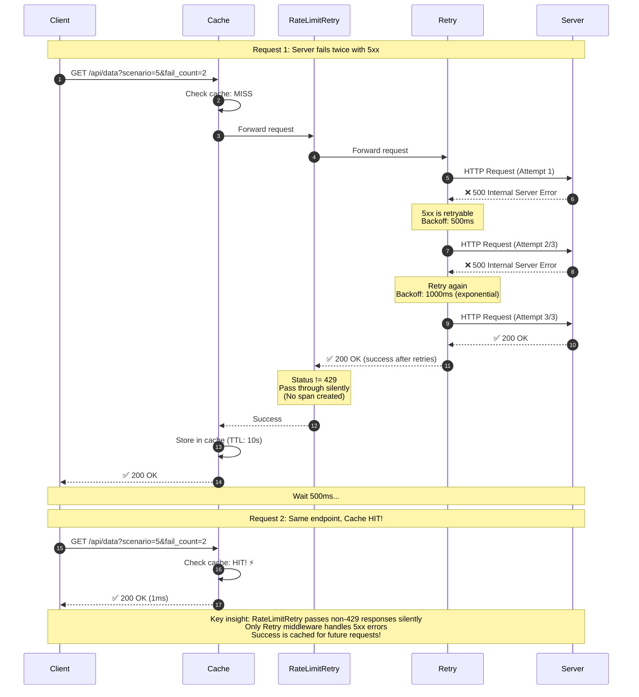

# Scenario 5: Cache MISS → 5xx → Retry → Success → Cache



## Key Points

- **Architectural Separation**: RateLimitRetry only creates spans for 429, passes all other responses through silently
- **Retry Handles 5xx**: General retry middleware catches transient server errors (status >= 500)
- **Success Cached**: Once successful, response is cached for 10 seconds
- **No Redundant Spans**: RateLimitRetry creates no span for non-429 responses (clean trace)
- **Single Responsibility**: Each middleware has one job - RateLimitRetry focuses solely on rate limit (429) handling

## Why This Design?

```go
// RateLimitRetry: Root span created at entry
ctx, rootSpan := r.tracer.Start(ctx, "ratelimit.middleware")
defer rootSpan.End()

// If not 429, pass through
if resp.StatusCode != http.StatusTooManyRequests {
    rootSpan.SetAttributes(attribute.Bool("ratelimit.triggered", false))
    return resp, nil  // Pass through silently
}
// Only create attempt span if 429 detected
_, span := r.tracer.Start(ctx, "ratelimit.attempt")

// Retry: General transient failures
if err == nil && resp.StatusCode < 500 {
    return resp, nil  // Success (includes 429, 4xx)
}
// Only retry 5xx and network errors
```

**Single Responsibility Principle**: Each middleware has one job
- RateLimitRetry: Respect API rate limits (429 only)
- Retry: Handle transient failures (5xx, network errors)
- Cache: Store successful responses

## What You'll See in Jaeger

### Request 1 (with retries):
- `retry.middleware` root span (from Retry middleware)
- `retry.attempt` sub-spans for each attempt (3 attempts)
- `retry.backoff` wait spans (500ms, 1000ms)
- `ratelimit.middleware` root span (created at entry)
  - `ratelimit.triggered=false` (no 429 encountered)
  - `ratelimit.total_429s=0`
- **NO** `ratelimit.attempt` child spans because:
  - RateLimitRetry only creates attempt spans for 429 responses
  - For non-429 (including 5xx), no attempt span is created
  - This keeps the trace clean when rate limiting doesn't occur
- Final status: Success (green)
- Span duration: ~1.5 seconds (includes backoff)

### Request 2 (cache hit):
- `cache.middleware` span only
- Cache attribute: `cache.hit=true`
- No retry spans (cached response)
- Span duration: ~1ms

## Benefits

- ✅ Clean separation of concerns
- ✅ Easier to debug (clear span hierarchy)
- ✅ Efficient retry logic (no redundant middleware)
- ✅ Cache benefits from eventual success
