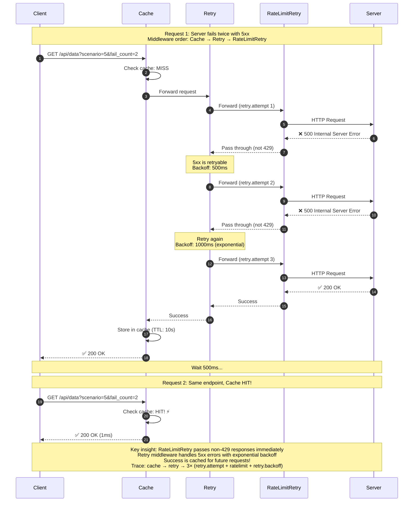

# Scenario 5: 5xx Retry

RateLimitRetry passes 5xx errors through to Retry middleware (architectural separation).

```mermaid
sequenceDiagram
    autonumber
    participant Client
    participant Cache
    participant Retry
    participant RateLimitRetry
    participant Server

    Note over Client,Server: Request 1: Server fails twice with 5xx<br/>Middleware order: Cache → Retry → RateLimitRetry

    Client->>Cache: GET /api/data?scenario=5&fail_count=2
    Cache->>Cache: Check cache: MISS
    Cache->>Retry: Forward request

    %% First attempt - 5xx error
    Retry->>RateLimitRetry: Forward (retry.attempt 1)
    RateLimitRetry->>Server: HTTP Request
    Server-->>RateLimitRetry: ❌ 500 Internal Server Error
    RateLimitRetry-->>Retry: Pass through (not 429)
    Note over Retry: 5xx is retryable<br/>Backoff: 500ms

    %% Second attempt - still 5xx
    Retry->>RateLimitRetry: Forward (retry.attempt 2)
    RateLimitRetry->>Server: HTTP Request
    Server-->>RateLimitRetry: ❌ 500 Internal Server Error
    RateLimitRetry-->>Retry: Pass through (not 429)
    Note over Retry: Retry again<br/>Backoff: 1000ms (exponential)

    %% Third attempt - Success!
    Retry->>RateLimitRetry: Forward (retry.attempt 3)
    RateLimitRetry->>Server: HTTP Request
    Server-->>RateLimitRetry: ✅ 200 OK
    RateLimitRetry-->>Retry: Success
    Retry-->>Cache: Success
    Cache->>Cache: Store in cache (TTL: 10s)
    Cache-->>Client: ✅ 200 OK

    Note over Client,Server: Wait 500ms...

    Note over Client,Server: Request 2: Same endpoint, Cache HIT!

    Client->>Cache: GET /api/data?scenario=5&fail_count=2
    Cache->>Cache: Check cache: HIT! ⚡
    Cache-->>Client: ✅ 200 OK (1ms)

    Note over Client,Server: Key insight: RateLimitRetry passes non-429 responses immediately<br/>Retry middleware handles 5xx errors with exponential backoff<br/>Success is cached for future requests!<br/>Trace: cache → retry → 3× (retry.attempt + ratelimit + retry.backoff)
```
