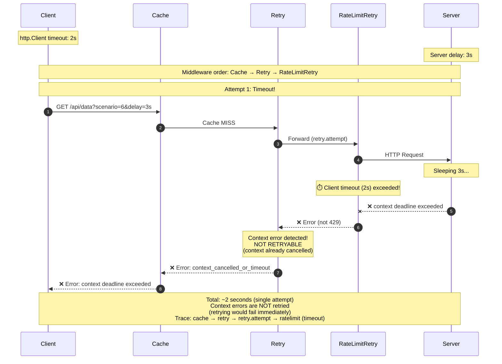

# Scenario 6: Client Timeout

Context errors (client timeout) are NOT retried - retrying with a cancelled context would fail immediately.

```mermaid
sequenceDiagram
    autonumber
    participant Client
    participant Cache
    participant Retry
    participant RateLimitRetry
    participant Server

    Note over Client: http.Client timeout: 2s
    Note over Server: Server delay: 3s
    Note over Client,Server: Middleware order: Cache → Retry → RateLimitRetry

    Note over Client,Server: Attempt 1: Timeout!

    Client->>Cache: GET /api/data?scenario=6&delay=3s
    Cache->>Retry: Cache MISS
    Retry->>RateLimitRetry: Forward (retry.attempt)
    RateLimitRetry->>Server: HTTP Request
    Note over Server: Sleeping 3s...
    Note over RateLimitRetry: ⏱️ Client timeout (2s) exceeded!
    Server--xRateLimitRetry: ❌ context deadline exceeded
    RateLimitRetry-->>Retry: ❌ Error (not 429)
    Note over Retry: Context error detected!<br/>NOT RETRYABLE<br/>(context already cancelled)

    Retry-->>Cache: ❌ Error: context_cancelled_or_timeout
    Cache-->>Client: ❌ Error: context deadline exceeded

    Note over Client,Server: Total: ~2 seconds (single attempt)<br/>Context errors are NOT retried<br/>(retrying would fail immediately)<br/>Trace: cache → retry → retry.attempt → ratelimit (timeout)
```
