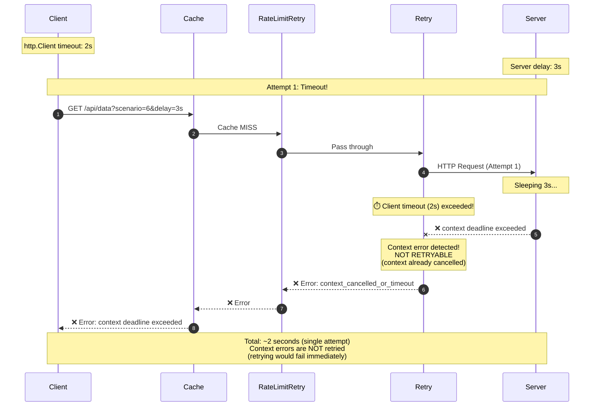

# Scenario 6: Client Timeout Demonstration



## Key Points

- **Client Timeout:** 2 seconds (shorter than normal 60s for demo purposes)
- **Server Delay:** 3 seconds (exceeds client timeout)
- **Timeout Error:** `context deadline exceeded`
- **Retry Behavior:** Context errors are **NOT retried** (context already cancelled)
- **Total Attempts:** 1 attempt only (no retries)
- **Backoff:** None (stops immediately)
- **Final Result:** ERROR immediately after first timeout

## What You'll See in Jaeger

### Request Trace (ERROR status)
- **Root span:** `scenario-6-timeout-demo` (red/error)
- **Cache span:** `cache.middleware` with `cache.hit=false`
- **Retry handler:** `retry.middleware` with `retry.total_attempts=1`, `retry.succeeded=false`, `retry.final_error=context_cancelled_or_timeout`
- **1 Retry attempt span:** Shows:
  - `retry.attempt` with attempt number 0
  - `retry.error=context_cancelled_or_timeout`
  - Error recorded: `context deadline exceeded`
  - No `http.status_code` (request never completed)
- **No backoff spans:** Stops immediately when context error detected
- **Total duration:** ~2 seconds (just the timeout)

### Span Attributes
```yaml
retry.middleware:
  retry.total_attempts: 1
  retry.succeeded: false
  retry.final_error: "context_cancelled_or_timeout"
  otel.status_code: ERROR
  error: true

retry.attempt:
  retry.attempt: 0
  retry.max_retries: 3
  retry.failed: true
  retry.failure_reason: "context_error: context deadline exceeded"
  retry.error: "context_cancelled_or_timeout"
  otel.status_code: ERROR
  error: true
```

## Configuration

```go
// Client with SHORT timeout for demonstration
shortTimeoutClient := &http.Client{
    Timeout: 2 * time.Second,  // Shorter than server delay
}

// Wrapped with retry middleware
httpClient := middleware.WrapClient(shortTimeoutClient,
    middleware.Cache(...),
    middleware.RateLimitRetry(...),
    middleware.Retry(middleware.RetryConfig{
        MaxRetries: 3,
        Backoff: middleware.NewExponentialBackoff(
            500*time.Millisecond,  // Initial
            5*time.Second,         // Max
            30*time.Second,        // Max elapsed
        ),
        Tracer: otelTracer,
    }),
)
```

## Why This Matters

### 1. Context Errors Should NOT Be Retried
- **Context is already cancelled:** After `http.Client.Timeout`, the context is dead
- **Retrying is pointless:** A second attempt with cancelled context will fail immediately
- **Fail fast principle:** Detect context errors and stop retrying immediately
- **Saves time:** No wasted backoff/retry cycles

### 2. Timeout Types
There are two types of timeouts:

**http.Client.Timeout (this scenario):**
- ❌ **NOT retryable** - cancels the context permanently
- Applies to entire request (including retries)
- Best for: Setting maximum overall request time

**Server-side timeouts / slow responses:**
- ✅ **Retryable** - context still valid, just slow server
- Might succeed on retry (different server, cache hit, etc.)
- Best for: Handling transient slowness

### 3. Production Considerations
- **Set realistic timeouts:** Balance between patience and responsiveness
- **Understand timeout scope:** Client timeout applies to ALL retries combined
- **Use context timeouts carefully:** They propagate through the middleware chain
- **Monitor timeout rates:** High rates indicate capacity issues

### 4. Alternative Approaches
- **Increase client timeout:** If server legitimately needs more time
- **Use per-request timeouts:** Set deadline on context, not client
- **Add circuit breaker:** Stop trying if server is consistently slow
- **Separate read/write timeouts:** Different timeouts for different operations

## Comparison with Other Scenarios

| Scenario | Failure Type | Retry Behavior | Result |
|----------|--------------|----------------|--------|
| **2** | 5xx errors | ✅ Retries, succeeds on 3rd | Success |
| **3** | 429 rate limit | ✅ Waits, retries | Success |
| **4** | Persistent 429 | ✅ Exhausts retries | Fail gracefully |
| **7** | Client timeout (context cancelled) | ❌ **NO retry** (context error) | Fail immediately |

## Expected Output

```
📌 Scenario 6: Client Timeout Demonstration
   Tests what happens when http.Client timeout is exceeded
   Client timeout: 2s, Server delay: 3s

   Request 1: Server delay (3s) > Client timeout (2s)
   Expecting: Multiple timeout errors, then failure
   ⚠️  Expected timeout failure: request failed: Get "http://localhost:8081/api/data?scenario=6&delay=3s":
       request failed due to context cancellation after 1 attempts: context deadline exceeded
   (took 2003ms total - single attempt, no retries)
   Check Jaeger: retry.attempt shows context_cancelled_or_timeout error
```

## Learning Points

1. ✅ **Context errors are special** - they indicate the context is already cancelled
2. ✅ **Retry middleware detects context errors** and stops immediately (no retry)
3. ✅ **Fail fast principle** - don't waste time retrying impossible requests
4. ✅ **http.Client.Timeout cancels context** - makes retries pointless
5. ⚠️ **Client timeout applies to ALL retries** - set it high enough for retries to work
6. ⚠️ **Distinguish timeout types** - network timeouts vs context cancellation
